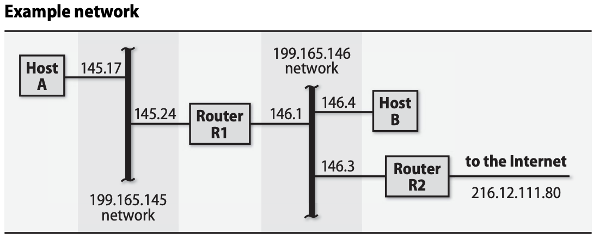

## Table of Contents
[Chapter 14 - TCP/IP Networking](#Chapter-14---TCP/IP-Networking)
[Chapter 15 - Routing](#Chapter-15---Routing)
[Chapter 16 - Network Hardware](#Chapter-16---Network-Hardware)

## Chapter 14 - TCP/IP Networking

### TCP/IP and Its Relationship too the Internet

- TCP/IP is an open and non-proprietary protocol suite.
- Requests for Coomments (RFCs) standardize internet protocols.
- Relevant RFCs:
    * RFC791: Internet Protocol (IP)
        + Routes data from one machine to another.
    * RFC792: Internet Control Message Protocol (ICMP)
        + Low level support for IP for debugging.
    * RFC826: Address Resolution Protocol (ARP)
        + Translates IP addresses to hardware addresses.
    * RFC768: User Datagram Protocol (UDP)
        + Unverified one-way data delivery.
    * RFC793: Transmission Control Protocol (TCP)
        + Reliable, full duplex, error-corrected conversations.
- TCP/IP layering model
    1. Application layer
        * ARP (goes to ARP)
        * SSH, FTP, HTTP (goes to TCP)
        * DNS, gaming (goes to UDP)
        * traceroute (goes to UDP or ICMP)
    2. Transport layer
        * TCP (goes to IP)
        * UDP (goes to IP)
    3. Network layer
        * IP (goes to ARP, device drivers)
        * ICMP (goes horizontally to IP)
    4. Link layer
        * ARP
        * Device drivers
    5. Physical layer
        * Optical fiber
        * Radio waves
- Data travels on a network in packets.
- Each packet has a header and a payload.
    * Header tells where packet came from and where it is going.
    * Payload is the data to be transferred.
- Primitive data unit is called:
    * A segment in the TCP layer.
    * A packet in the IP layer.
    * A frame in the link layer.
- Each protocol adds its own header to the packet.
    * This nesting is known as encapsulation.
    * On receiving machine, encapsulation is reversed.
- Link layer adds headers to packets and separates them so receiver can tell where one stops and another begins.
    * This process is known as framing.
- Maximum transfer unit (MTU) over ethernet is 1500 bytes.
- IP layer splits packets to conform to the MTU.
- TCP protocol does path MTU discovery automatically to find hop with the smallest MTU to determine how small packets must be sized to reach the destination.
- Use `ifconfig` to set an interface's MTU.

### Packet Addressing

- Several packet addressing schemes:
1. MAC addresses for hardware.
2. IPv4 and IPv6 network addresses for software.
3. Hostnames for use by people.
- IP addresses identify network interfaces, not machines!
- MAC addresses are 2-digit hex bytes e.g., `00:50:8D:9A:3B:DF`.
- IP addresses are universally unique and hardware independent.
- IP to hardware address done at the link layer.
- One or more hostnames can map too IP addresses using `/etc/hosts`, LDAP or DNS.
- Port is a 16-bit number that supplments an IP to specify a particular communication channel.
- Services are bound to certain ports in `/etc/services`.
- Address types includes unicast, multicast, broadcast, and anycast.

### IP Addressing: The Gory Details

- Internet addresses consist of a network and a host portion
    * Network identifies a logical network
    * Host poriton identifies a node on the network
- `127.0.0.1` is the localhost
- `ifconfig` sets an interface's IP address
- Internet address classes (1st byte):
    * Class A (1-127): early networks
    * Class B (128-191): large sites
    * Class C (192-223): easy to get
    * Class D (224-239): multi-cast
    * Class E (240-255): experimental
- Subnet masks define which portion of the address is for the network and which are for the hosts.
    * Example `255.255.0.0` results in N.N.H.H

### CIDR Notation

- In CIDR notation, network ends with `/XX` which is the number of bits in the network portion.
    * Example: `128.138.243.0/24` means `128.138.243` is the network.
- Consider `172.16.0.0/12`
    * The IP can be rewritten in binary as:
    ```
    1010 1100 - 0001 0000 - 0000 0000 - 0000 0000
    ```
    where `2^7+2^5+2^3+2^2=172, 2^4=16`.
    * The `/12` indicates the first 12 bits are masked for the network. Therefore the following is fixed for the network:
    ```
    1010 1100 - 0001
    ```
    * The remaining bits can represent the hosts. Therefore the starting host is:
    ```
    1010 1100 - 0001 0000 - 0000 0000 - 0000 0000
    ```
    The ending host is:
    ```
    1010 1100 - 0001 1111 - 1111 1111 - 1111 1111
    ```
    or in decimal terms: `127.16.0.0` to `127.31.255.255`.

### Private Address and Network Address Translation (NAT)

- Private addresses are used by site internally but not shown to internet
- Border router translates between private and public IP
- Reserved private IPs:
    * Class A (10.0.0.0/8)
    * Class B (172.16.0.0/12)
    * Class C (192.168.0.0/16)
- Site's border router runs a NAT to allow hosts on private addresses to talk with internet
- NAT maintains mapping between internal and external address/port pairs

### Routing

- Routing packets takes the form of rules (rooutes)
- Routing information is stored in a table in the kernel
- Routing means:
    1. Looking up a network address in the routing table to forward a packet to its destinatioon
    2. Building the routing table in the first place
- `netstat -r` to view routing table
    * Shows a host's network interfaces (e.g., `eth0` and `eth1`)
    * Shows Gateway associated with interfaces and their destination
    * Host can only rouote packets to gateway machines that are reachable throuogh a directly connected network
- `route add` to add a route

### ARP: Address Resolution Protocol

- Hardware addresses needed to transport data across a network's link layer.
- ARP finds hardware address associated with an IP
- If host A wants to send a packet to host B on same network, it uses ARP to find B's hardware address
- If not on same network, host A uses ARP to find router
- ARP is cached on each machine
- ARP works by broadcasting packet asking for hardware address for an IP
    * Corresponding machine replies: yes, that is the IP assigned to one of my interfaces with hardware address
- `arp` examines and manipulates the kernel's ARP cache
    * Useful for debugging e.g., two hosts using same IP

### DHCP: The Dynamic Host Configuratioon Protocol

- When you plug in a device into a network, DHCP is used to:
    * Obtains IP address for itself on local network
    * Sets up appropriate default route
    * Connects itself to a local DNS server
- Protocol lets a DHCP client lease a variery of network parameters from a central server that is authorized to distribute them:
    * IP addresses and netmasks
    * Gateways (default routes)
    * DNS servers
    * Syslog hosts
    * Proxy servers, NTP servers
- Clients report back periodically too DHCP server to renew their leases

### DHCP Software

- Server package is called `dhcp3-server` on Ubuntu
- Recommended to use ISC package over vendor specific implementations

### How DHCP Works

- DHCP client broadcasts "Who am I?" message
- DHCP server negotiates with client to provide an IP address and other networking parameters
- When client's lease time is over, it attempts to renew its lease

### ISC's DHCP Software

- ISC's daemon is called `dhcpd`, config file is in `/etc/dhcpd.conf` or `/etc/dhcp3/dhcpd.conf`
- ISC's DHCP client stores status files in `/var/lib/dhcp`

### Security Issues

- IP forwarding: best to turn off unless server is meant to be a router since packets can be coerced to oseem like they are coming from within the network
- ICMP redirects: can maliciously reroute traffic and tamper with routing tables
- Broadcast pings have been used in DDoS attacks
- IP spoofing: if software creating packet uses raw socket, it can fill in any source address it likes
- VPN establishes a series of secure, encrypted tunnels from various locations

### Basic Network Configuration

- Basic steps to add a new machine to a local network:
    1. Assign it a unique IP and hostname
    2. Make sure network interfaces configured at boot time
    3. Set up default route
    4. Point to a DNS server to allow it access to internet
- Most configuration done on DHCP server
- Use `ping` and `traceroute` to debug

### Hostname and IP address assignment

- Mapping from hostname to IP best maintained through:
    * `hosts` file
    * LDAP
    * DNS
    * Some combination of above options
- `/etc/hosts` oldest and simplest way to map names to IPs
    * Example line: `127.0.0.1 localhost`
- Use DNS or LDAP to find mappings for rest of local network or the world wide web
- `hostname` assigns a hostname to a machine

### ifconfig: configure network interfaces

- `ifconfig` command:
    * Enables or disables a network interface
    * Sets its IP and subnet mask
    * Example: `ifconfig eth0 192.168.1.13 netmask 255.255.255.0 up`
    * Sets IP and netmask for interface eth0 and readies it for use
- `ifconfig -a` lists the system's network interfaces

### route: configure static rouotes

- `route` defines static routes
- Routing performed at the IP layer
- Packet's destination IP is compared with the routes in the kernel's routing table; there are two cases:
    1. Packet destined for some host on a directly connected network; next-hop gateway address in the routing table is that local host's own interface; packet sent directly to that host; this type of route is added to the routing table by `ifconfig`
    2. If no route matches the destination, the default route is invoked; otherwise an ICMP network unreachable message is returned to to the sender
- Example: `route add -net 192.168.45.128/25 zulu-gw.atrust.net`
    * Adds route to the `192.168.45.128/25` network thruogh the gateway rouoter `zulu-gw.atrust.net` which must be an adjacent host or a local host's own interfaces
- Other tips:
    * `netstat -nr` to see existing ruotes
    * Use `default` keyword to set default route
    * `route delete` or `route del` to remove entries of a routing table
    * `route flush` to initialize the routing table
    * `/etc/networks` maps names to network numbers like the `hosts` file for mapping hosotnames to IP addresses
    * `rouote add -host` to set up a route thats specific to a single IP

### DNS configuration

- To configure a machine as a DNS client, set up `/etc/resolv.conf`
    * Lists DNS domains that should be searched to resolve names
    * Should list closest stable DNS servers first
    * DHCP client typically adds addresses into `resolv.conf`

### System-Specific Network Configuration

- Use of `/etc/hosts` and `/etc/resolv.conf` relatively constant among Linux systems

### Linux Networking

- After any change to a file that controls network config at boot, you may need to either reboot or bring network interface down then up again
- Use `ifdown <interface>` and `ifup <interface>`

### Ubuntu Network Configuration

- Ubuntu configures the network in:
    * `/etc/hostname` - sets hostname
    * `/etc/network/interfaces` - sets IP address, netmask and default gateway
- `ifup` and `ifdown` bring up and down the interfaces

### Linux Network Hardware Options

- `ethtool` queries and sets a network interface's media-specific parameters such as link speed and duplex
- `ethtool eth0` to query the status of eth0 interface

### Linux TCP/IP Options

- Linux puts representation of kernel tunable variables into `/proc`
- `/proc/sys/net/ipv4` shows networking variables many of which with `rate` and `max` in their names are used to thwart DDoS attacks
- `/proc/conf` contains variables set per interface
- To change any parametrs permanently add the appropriate variables to `/etc/sysctl.conf`

### Security-Related Kernel Variables

- Default security-related network behaviors in Linux:
    * IP forwarding
        + Host off, gateway on
        + `ip_forward` and `conf/interface/forwarding`
    * ICMP redirects
        + Host obeys, gateway ignores
        + `conf/interface/accept_redirects`
    * Source routing
        + Host and gateway varies
        + `conf/interface/accept_source_route`
    * Broadbcast ping
        + Host and gateway ignores
        + `icmp_echo_ignore_broadcasts`

### Linux NAT and Packet Filtering

- Linux implements a limited form of NAT known as Port Address Translation (PAT)
- Instead of using a range of IP addreses, PAT multiplexes all connections onto a single address
- `iptables` implements NAT and packet filtering
- For NAT to work, we must enable IP forwarding in the kernel by setting `/proc/sys/net/ipv4/ip_forward` kernel variable to `1`
- To route packets using NAT:
    * `sudo iptables -t nat -A POSTROUTING -o eth1 -j SNAT --to 63.173.189.1`
    * eth0 is the interface connected to internet (its IP address is 63.173.189.1)
    * eth1 interface is the one connected too othe internal network
    * To internet hosts, it appears all packets from hosts on the internal network have eth0's IP address
    * NAT host receives incoming packets, looks up their true destinatioons, rewrites them with the appropriate internal network IP and sends them

## Chapter 15 - Routing

### Packet Forwarding: A Closer Look

- Consider the sample network below:



- `R1` connects two networks and `R2` connects one of the networks to the internet
- Assume `R1` and `R2` as Linux machines
- Host `A` routing table can be found by running `netstat -rn`
```
Destination   Gateway        Genmask       Flags Iface
199.165.145.0 0.0.0.0        255.255.255.0 U     eth0
127.0.0.0     0.0.0.0        255.0.0.0     U     lo
0.0.0.0       199.165.145.24 0.0.0.0       UG    eth0
```
- `eth0` is host `A` Ethernet interface
- `lo` is the loopback interface
- Above two usually added by `ifconfig`
- Default route forwards all packets not addressed to `lo` or to `199.165.145.0` network to the router `R1`
- `G` flag indicates its a Gateway which must be only one hop away
- Suppose `A` sends packet to `B`, IP implementation looks foor a route to the target network `199.165.146` but none of the routes match
    * Default route is invoked and packet is forwarded to `R1`
- Ethernet packet is formed
    * Ethernet header says from `A` to `R1` type IP
    * IP header says from `199.165.145.17` too `199.165.146.4` type UDP (no mention of `R1`)
    * UDP header and payload is last
- Routing table for host `R1`
```
Destination   Gateway        Genmask       Flags Iface
127.0.0.0     0.0.0.0        255.0.0.0     U     lo
199.165.145.0 0.0.0.0        255.255.255.0 U     eth0
199.165.146.0 0.0.0.0        255.255.255.0 U     eth1
0.0.0.0       199.165.146.3  0.0.0.0       UG    eth0
```
- Two physical network interfaces
- Default route to `R2` since that is the internet gateway
- Routing table for host `B`
```
Destination   Gateway        Genmask       Flags Iface
127.0.0.0     0.0.0.0        255.0.0.0     U     lo
199.165.145.0 199.165.146.1  255.255.255.0 U     eth0
199.165.146.0 0.0.0.0        255.255.255.0 U     eth0
0.0.0.0       199.165.146.3  0.0.0.0       UG    eth0
```
- `B` needs an additional route because it has direct connections to two routers

### Routing Daemons and Routing Protocols

- Routing protocols can adapt to changing network conditions e.g., if a link goes down, routing daemons can discover and propagate alternative routes to the networks served by that link
- Routing daemons collect information from config files, routing tables and routing daemons oon other systems
    * This information is merged to compute an optimal set of routes which are written back to routing table
- Routes are computed based on routing protocol
- Two main routing protocols:
    1. Distance-vector protocol: each host announces how far they are from the networks they know about; hosts mark other hosts as the best gateway to a particular network; over time every hosts routing tables converge to a steady state
    2. Link-state protocols: records traded among routers to form a connectivity map of the network from which each router can compute its own routing table
- For routing, quality of a link is represented by a number called the cost metric
- Path cost is the sum of the costs of each link in the path
- Protocols for routing between automous systems must often handle routes for many networks (e.g., the entire internet), and they must deal with fact that neighboring routers are under other people's control
- Exterior protocols do not reveal the topology inside an autonomous system so they can be thought oof as a second level of routing hierarchy that deals with collections of nets rather than individual hosts or cables

### Protocols on Parade

- Routing information protocol (RIP)
    * Distance vector protocols that use hop counts as cost metric
    * Profligate use of broadcasting
    * Good job of handling changing network
    * Slow to stabilize after a link goes down
- Open shortest path first (OSPF)
    * Works well for large, complicated topologies
    * Advantage over RIP includes ability to manage several paths to a single destination
    * No particular cost metric
- Enhanced Interior Gateway Routing Protocol (EIGRP)
    * Runs only on Cisco routers
    * Distance-vector protocol designed to avoid looping and convergence problems
- IS-IS
    * ISO's answer to OSPF
- Router Discovery Protocol and Neighbor Discovery Protocol
    * Uses ICMP messages sent to IP multicast to aanoounce and learn about other routes on a network
- Border Gateway Patrol (BGP)
    * Exterior routing protocol (manages traffic among autonomous systems)
    * Standard protocol used for Internet backbone routing

### Routing Strategy Selection Criteria

- Routing can be managed at four levels of complexity:
    1. No routing
    2. Static routing
    3. Mostly static but clients listen for RIP updates
    4. Dynamic routing
- Rule of thumbs:
    * Standalone network requires no routing
    * If network has one way out, clients should have static default route to the lone gateway
    * Gateway with multiple networks on one side and internet oon the other should have explicit static routes pointing to former and default route to the latter
    * RIP works okay and is widely supported
    * EIGRP and OSPF are equally functional but EIGRP is proprietary to Cisco
    * Roouters connected to the internet through multiple upstream provider must use BGP
- For medium-sized site with stable local structure and connection to ooutside internet, use a combination of static and dynamic routing
    * Routers within loocal structure use static, forwarding unknown packets to a default machine that understands outside world and does dynamic routing

### Routing Daemons

- Use of routing daemons is uncommon on production systems
- Detailed routers are simpler, more reliable, more secure and faster
- Common software options
    * `routed`: obsolete RIP implementation
    * `gated`: first-generation multiprotocol routing daemomn
    * `Quagga`: mainstream routing daemon; go-to for Linux
    * `XORP`: router in a box

## Chapter 16 - Network Hardware